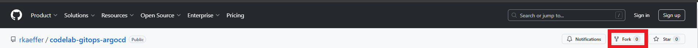
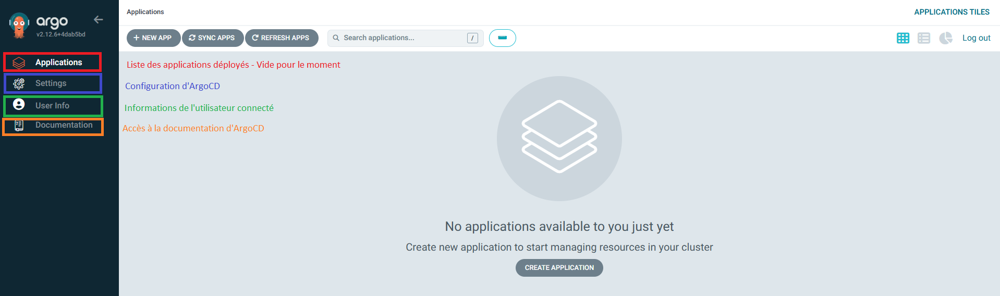
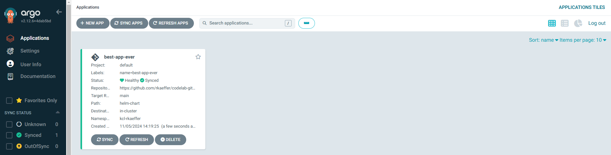
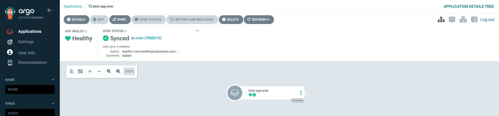
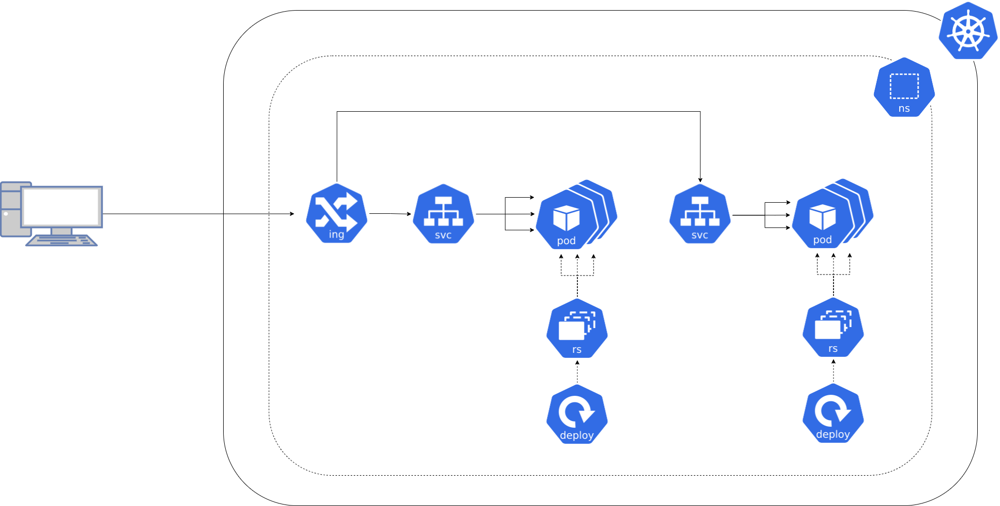
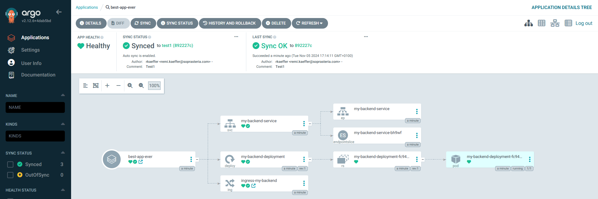

# TechNext4CNAM - Codelab GitOps

:rocket: Bievenue dans ce codelab GitOps ! :rocket:

Aujourd'hui, nous allons explorer la manière de mettre en place le GitOps avec ArgoCD !

L'approche GitOps repose sur l'utilisation de référentiels Git comme unique source de vérité pour distribuer l'infrastructure en tant que code. Ainsi, l'approche GitOps apporte les avantages suivants : 

* **Audit et Traçabilité :** Chaque changement est versionné et traçable grâce à l'historique Git, ce qui facilite l'audit des modifications et l'identification de la source des problèmes.

* **Automatisation et Cohérence :** En automatisant les déploiements à partir des dépôts Git, GitOps réduit les erreurs humaines et assure une cohérence entre votre environnement de développement, de test et de production.

* **Temps de Récupération Réduit :** En cas de problème, vous pouvez rapidement restaurer un état précédent de l'application ou de l'infrastructure simplement en revenant à une version antérieure du dépôt Git.

* **Collaboration Facilitée :** Les développeurs et opérateurs peuvent collaborer plus efficacement via des pull requests et des revues de code, facilitant l'adoption de meilleures pratiques et la gestion des modifications.

* **Rapidité de Déploiement :** Les changements peuvent être déployés rapidement et fréquemment grâce à un processus automatisé, favorisant l'amélioration continue et l'innovation.

* **Alignement avec les Principes DevOps :** GitOps s’aligne parfaitement avec les principes DevOps en intégrant le contrôle de version, l’automatisation et la collaboration dans le processus de gestion de l’infrastructure.

## Objectifs du codelab

Passons aux choses sérieuses ! Dans ce codelab, vous allez :
* Créez votre première applications sous ArgoCD, et découvrir toutes les subtilités de configurations applicables sur une application ArgoCD
* Construire un déploiement pour déployer une application backend
* Construire un déploiement pour déployer une application frontend
* Jouer avec les capacités de self-healing d'ArgoCD
* Explorer comment le GitOps facilite les opérations de décomissionnement
* Explorer comment le GitOps peut nous aider en cas de mise en production qui se passe mal

Allez, c'est parti ! 🙂

## Présentation de l'environnement

Nous vous avons mis un disposition un cluster Kubernetes déployé sur le cloud public Azure ([Azure Kubernetes Services](https://azure.microsoft.com/fr-fr/products/kubernetes-service)).

Un **identifiant** vous est attribué à tous. Ce dernier est systématiquement composé de la manière suivante : **[premiere_lettre_de_votre_prenom][votre_nom]**. Voici deux exemples : 
* Rémi KAEFFER -> rkaeffer
* Jason BOURLARD -> jbourlard

Par défaut, ce cluster vous propose les services suivants : 
* Une instance commune d'ArgoCD, qui va vous permettre de déployer vos applications, et disponible à l'URL suivante : https://argo-cd.codelab.cloud-sp.eu/
    * Username : admin
    * Password : A REMPLIR LE JOUR DU LAB - ET A EFFACER APRES
* Un environnement de développement pour chacun d'entre vous, composés de deux namespaces : 
    * Un namespace, nommé kcl-[identifiant]-wk, portant un OpenVScode et tout plein d'outils (kubectl, git, ...), et accessible à l'url [[identifiant]-kcl.codelab.cloud-sp.eu](tochange-kcl.codelab.sp.eu)
    * Un namespace, nommé kcl-[identifiant], où devra être déployé vos applications

## Pré-requis avant de démarrer

Pour pouvoir effectuer ce codelab, quatres pré-requis sont nécessaires (Pas de panique, rien à installer 😁) : 
* Etre connecté à notre réseau Wifi SSG-Guest (Normalement, on vous a autorisé ce matin, si ce n'est pas le cas, faites le nous savoir) !
* Disposer d'un compte Github, et avoir généré un [personal token](https://docs.github.com/en/authentication/keeping-your-account-and-data-secure/managing-your-personal-access-tokens#creating-a-personal-access-token-classic) d'accès pour pouvoir push sur vos repositories
* Vérifier que vous avez bien accès à [ArgoCD](https://argo-cd.codelab.cloud-sp.eu/)
* Vérifier que vous avez bien accès à votre environnement de travail : [[identifiant]-kcl.codelab.cloud-sp.eu](tochange-kcl.codelab.sp.eu)

Cette fois-ci, vous êtes prêt !

## Instructions du codelab

### Etape 0 - Préparation et exploration

Pour démarrer ce codelab, vous devez commencer par **forker dans votre espace personnel github** le repository https://github.com/rkaeffer/codelab-gitops-argocd. 



Ce repository contient les sources qui seront à compléter durant ce lab.

Il est composé comme suit : 

```
codelab-gitops-argocd
│   README.md ==> Les instructions du lab
│   argocd-application.yaml ==> Descripteur application argocd 
│
└───helm-chart ==> Contient un chart Helm que nous allons déployer 
│   │   Chart.yaml ==> Descripteur du chart Helm
│   │   values.yaml ==> Fichier de values du chart Helm
│   │
│   └───templates ==> Contient les manifests K8S que l'on va vouloir déployer
│       │   ...
│   
└───docs ==> Contient les images du README (A ignorer)
    │   ...
```

Une fois que vous avez forké votre le repository dans votre espace personnel github, vous devez le cloner dans votre environnement de travail.

Pour cela, ouvrez un terminal dans votre espace de travail OpenVScode ([[identifiant]-kcl.codelab.cloud-sp.eu](tochange-kcl.codelab.sp.eu)) :
*  Terminal -> New Terminal (Ou Ctrl + Shift + ù)

Par défaut, le terminal est positionné dans un dossier "workspace" dans lequel vous allez travailler. C'est également ce dossier qui est positionné dans l'explotateur de fichier d'OpenVSCode.

```bash
git clone https://github.com/[username]/codelab-gitops-argocd
```

Votre environnement est configuré pour pouvoir manipuler le cluster Kubernetes sans configurer spécifique.
Lancer la commande suivante et observer le résultat.

```bash
kubectl get ns
```

Vous pouvez observer que tout un ensemble de namespaces sont présents :
* Les namespaces portant vos environnements de développement
* Un namespace argo-cd, portant le déploiement d'ArgoCD
* D'autres namespaces "techniques" nécessaires au bon fonctionnement de ce codelab

Allons faire un tour sur [ArgoCD](https://argo-cd.codelab.cloud-sp.eu/) :



N'hésitez pas à faire un tour des différents onglets pour explorer ce qu'ils contiennent !

### Etape 1 - Créer une application dans ArgoCD

Comme expliqué en introduction, l'approche GitOps repose sur l'**utilisation de référentiels Git comme unique source de vérité** pour distribuer l'infrastructure en tant que code. ArgoCD nous permet de mettre en oeuvre ce principe en déployant sur un ou plusieurs clusters des descripteurs de déploiement stocké dans Git.

ArgoCD va ainsi nous permettre de définir des **applications**, décrites par un **ensemble de paramètre, notamment un lien vers un repository Git** qui contient les descriteurs que nous voulons déployer.

Vous allez devoir créer votre première aplication dans ArgoCD en complétant la partie haute du fichier argocd-application !

```yaml
apiVersion: argoproj.io/v1alpha1
kind: Application
metadata:
  name: #TODO - Nom de votre application - Libre :)
  namespace: argo-cd
  finalizers:
    - resources-finalizer.argocd.argoproj.io
  labels:
    name: #TODO - Nom de votre application - Libre :)
spec:
  project: default
  # Source of the application manifests
  source:
    repoURL: #TODO - Lien vers votre repository GitHub
    path: #TODO - Chemin du chart Helm dans votre repository git 
    targetRevision: #TODO - Branche à cibler de votre repository Git 
    helm:
      releaseName: #TODO - Nom à donner à votre release helm - Libre :)
  # Destination cluster and namespace to deploy the application
  destination:
    name: in-cluster
    namespace: #TODO - Namespace de déploiement de votre application
```

A vous de jouer 😉

Observez ensuite la partie basse du fichier : 

```yaml
 # Sync policy
  syncPolicy:
    automated: # automated sync by default retries failed attempts 5 times with following delays between attempts ( 5s, 10s, 20s, 40s, 80s ); retry controlled using `retry` field.
      prune: true # Specifies if resources should be pruned during auto-syncing ( false by default ).
      selfHeal: true # Specifies if partial app sync should be executed when resources are changed only in target Kubernetes cluster and no git change detected ( false by default ).
    syncOptions:     # Sync options which modifies sync behavior
    - Validate=true # disables resource validation (equivalent to 'kubectl apply --validate=false') ( true by default ).
    - CreateNamespace=true # Namespace Auto-Creation ensures that namespace specified as the application destination exists in the destination cluster.
    - PrunePropagationPolicy=foreground # Supported policies are background, foreground and orphan.
    - PruneLast=false # Allow the ability for resource pruning to happen as a final, implicit wave of a sync operation
    managedNamespaceMetadata: # Sets the metadata for the application namespace. Only valid if CreateNamespace=true (see above), otherwise it's a no-op.
      labels: # The labels to set on the application namespace
      annotations: # The annotations to set on the application namespace

    retry:
      limit: 5 # number of failed sync attempt retries; unlimited number of attempts if less than 0
      backoff:
        duration: 5s # the amount to back off. Default unit is seconds, but could also be a duration (e.g. "2m", "1h")
        factor: 2 # a factor to multiply the base duration after each failed retry
        maxDuration: 3m # the maximum amount of time allowed for the backoff strategy

  # RevisionHistoryLimit limits the number of items kept in the application's revision history, which is used for
  # informational purposes as well as for rollbacks to previous versions. This should only be changed in exceptional
  # circumstances. Setting to zero will store no history. This will reduce storage used. Increasing will increase the
  # space used to store the history, so we do not recommend increasing it.
  revisionHistoryLimit: 50
```

Ici, nous avons configurer tout ce qui est nécessaire pour le déploiement de notre application. Chaque paramètre est détaillé en commentaire.

Il est temps de tester (Sans douter, bien entendu) ! Déployer votre application dans le namespace argo-cd :
```bash
cd codelab-gitops-argocd
kubectl apply -f argocd-application.yaml -n argo-cd
```

Par défaut, argo-cd ne reconnait que les CRD (Custom Ressource Definition) argoproj.io/v1alpha1/application positionné dans son namespace de déploiement : argo-cd. Il est possible de le faire reconnaitre ces CRD dans d'autres namespaces en le configurant spécifiquement, mais ce n'est pas le sujet du jour !

Si tout s'est bien passé, vous devriez obtenir sur ArgoCD le résultat suivant : 




Vous pouvez explorez le détails de votre application sur ArgoCD. Vous constatez que pour le moment ArgoCD n'a pas déployé grand chose.

> [!NOTE]
> Pour aller plus loin, et pour passer à un cran au dessus dans l'approche GitOps, une utilisation courante dans l'industrie est de déployer un ArgoCD "applicatif" avec les configurations des applications qu'il doit déployer à l'aide d'un ArgoCD "infrastructure", pour que les équipes implémentant les applicatifs adopte une approche full GitOps (Pas de commande d'apply à faire sur le cluster Kubernetes). En somme : "Un ArgoCD pour les gouverner tous, un ArgoCD pour les déployer, un ArgoCD pour les superviser et dans le cloud les lier !"

### Etape 2 - Deploiement du backend

Avoir une application ArgoCD correctement configuré c'est bien, que cette application ArgoCD déploie un applicatif, c'est mieux ! 

Nous allons commencer par déployer un simple microservice Java. Nous avons préparé en avance une image de conteneur prête à l'emploi.

Voici un petit schéma qui rapelle les composants à mettre en oeuvre sur Kubernetes pour déployer et exposer une application : 



Vous allez créer un composant déploiement (deploy), qui va instancier un replicaSet (rs), qui va instancier des pods (pod). Ces pods vont être exposés sur le cluster à l'aide d'un service (svc). Les services sont exposés à l'extérieur du cluster à l'aide d'ingress (ing).

On est parti ! Commencer par observer le fichier `Chart.yaml` contenu dans le dossier `helm-chart`.

```yaml
apiVersion: v2
name: my-app-chart
description: My super chart for gitops codelab
type: application
version: 1.0.0
appVersion: 1.0.0
```

Pas de surprise ici, nous avons une déclaration d'un chart Helm tout ce qu'il y a de plus basique. Vous pouvez changer le nom de votre chart si vous le désirez.

Nous allons nous intéresser désormais au sous-dossier `helm-chart/templates`, qui contient nos différents descripteurs de déploiement : 
* `backend-deployment.yaml` : Composant deployment
* `backend-service.yaml` : Composant service
* `ingress-backend.yaml` : Composant ingress

Commencez par décommentez entièrement les 3 fichier (Sur chaque fichier : `Ctrl + a`, `puis Ctrl + /`).

Les fichiers sont déjà complétés pour vous. Nous ne détaillerons pas le contenu de chacun des fichiers. Gloablement, il s'agit de descritepru minimaliste pour déployer une appliction sur Kubernetes. Vous pouvez prendre le temps de les observer dans le détail, notamment le parametrage à faire à l'aide du templating Go par l'intermédiaire du fichier `values.yaml`. 

Vous allez devoir compléter le fichier `values.yaml`. Remplissez-le à l'aide des informations ci-dessous :

* Vous pouvez nommer librement votre application backend
* Le backend est servi par un serveur applicatif embarqué via SpringBootqui écoute sur le port `8080`
* L'image de conteneur du backend est disponible ici : `docker.io/rkaeffer/codelab-gitops-backend:1.0.0`
* Le nom de domaine à utiliser doit être dans le sous-domaine `*.codelab.cloud-sp.eu`. Le mieux est d'utiliser `[identifiant]-backend.codelab.cloud-sp.eu`
* Le service doit être exposé en TLS sur port `443`

Une fois cela fait, pushez votre travail sur votre repository github. Pour rappel, votre identifiant sur github est votre nom d'utilisateur github, et votre mot de passe est votre personal access token.

```shell
# ATTENTION : vous devez configurer quelques variables git avant votre premier commit
git config --global user.email "votre@email.com"
git config --gloabl user.name "Prénom nom"
git add .
git commit -m "Deploiement backend"
# ATTENTION : Au moment de votre premier push, vous devrez vous authentifier. La methode la plus simple est la suivante : une première pop-up apparait. Faites "Cancel". Puis le workspace demande votre nom d'utilisateur. Saisissez votre nom d'utilisateur github. Ensuite, le workspace vous demande votre mot de passe. Postionnez votre personal access token.
git push -u origin main
```

ArgoCD fait une opération de syncrhonisation automatique avec votre repository Git toutes les 180 secondes. Vous pouvez forcer la synchronisation en appuyant sur "SYNC" depuis la vue sur votre application.
Une fois la synchronisation déclenché, le déploiement se fait en quelques secondes.

Si tout se passe bien, vous devriez obtenir le résultat suivant : 



Sinon, corriger les erreurs, et recommencez !

> [!TIP]
> Si une synchronisation reste bloqué (Elle n'est pas réellement bloqué, c'est juste qu'il y 5 retry successifs de respectivement 5s, 10s, 20s, 40s et 80s, cf. fichier de configuration argocd dans syncPolicy.retry.backoff, ce qui peut donner une impression de blocage), forcer la fin de synchronisation en cliquant sur "Terminate" depuis la vue de détails de la syncrhonisation.

### Etape 3 - Deploiement du frontend

Cette fois-ci, on va déployer une application frontend. Il vous suffit de refaire exactement la même chose que pour le backend, mais cette fois-ci, vous devez tout faire tout seul, il n'y a pas de fichier par défaut pour vous aider 🤔. L'application frontend sera contenu dans le chart déjà défini dans notre repository.

Les paramètres / spécifications dont vous aurez besoin sont listés ci-dessous :
* Vous pouvez nommer librement votre application frontend
* Le frontent est servi sur un nginx écoutant sur le port `4200`
* L'image de conteneur du frontend est disponible ici : `docker.io/rkaeffer/codelab-gitops-frontend:1.0.0`
* Le nom de domaine à utiliser doit être dans le sous-domaine `*.codelab.cloud-sp.eu`
* Le service doit être exposé en TLS sur port `443`

Si tout s'est bien passé, vous devriez obtenir le résultat suivant sur ArgoCD : 

TODO image front

### Etape 4 - Jouons avec ArgoCD

Bon, c'est pas mal, on a réussi à déployer notre application frontend / backend avec ArgoCD. Mais concrètement, que nous apporte ArgoCD ?

Nous allons, à partir de cette étape, essayer de tester les capacités d'ArgoCD.

Imaginons que vous travaillez dans l'équipe d'exploitation du cluster. Vous effectuez au quotidien des opérations de maintenance sur le cluster.

Malheureusement, un matin, vous faites une mauvaise manipulation, et executez la commande suivante qui supprime le déploiement d'une de vos applications: 

```bash
kubectl delete deployment/[nom_deployment_backend] -n kcl-[identifant]
```

Le nom du deployment backend correspond à la valorisation du nom de l'application backend que vous avez positionné dans votre fichier de values, suivi de `-service`.
Vous pouvez également le récupérer en executant la commande suivante :

```bash
kubectl delete deployment/[nom_deployment_backend] -n kcl-[identifant]
```

Allez-y, executer la commande, et observer ce qui se passe sur ArgoCD (Attention ca va très vite !) 😁

Et oui... ArgoCD a corrigé tout seul l'erreur d'exploitation. En effet...

### Etape 5 - Décomissionement du frontend

### Etape 6 - Rollback du décomissionement

### Etape 7 - Pour aller plus loin

## Tips pour le lab